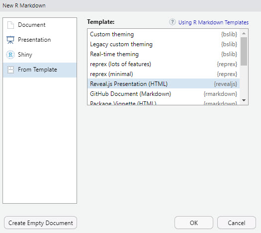
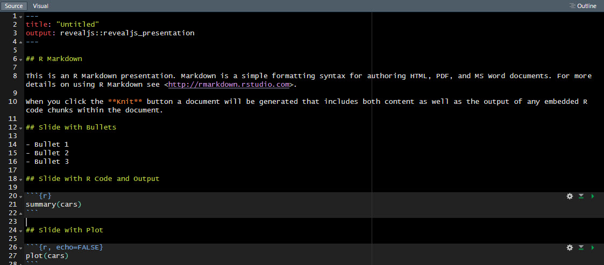
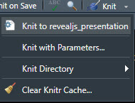
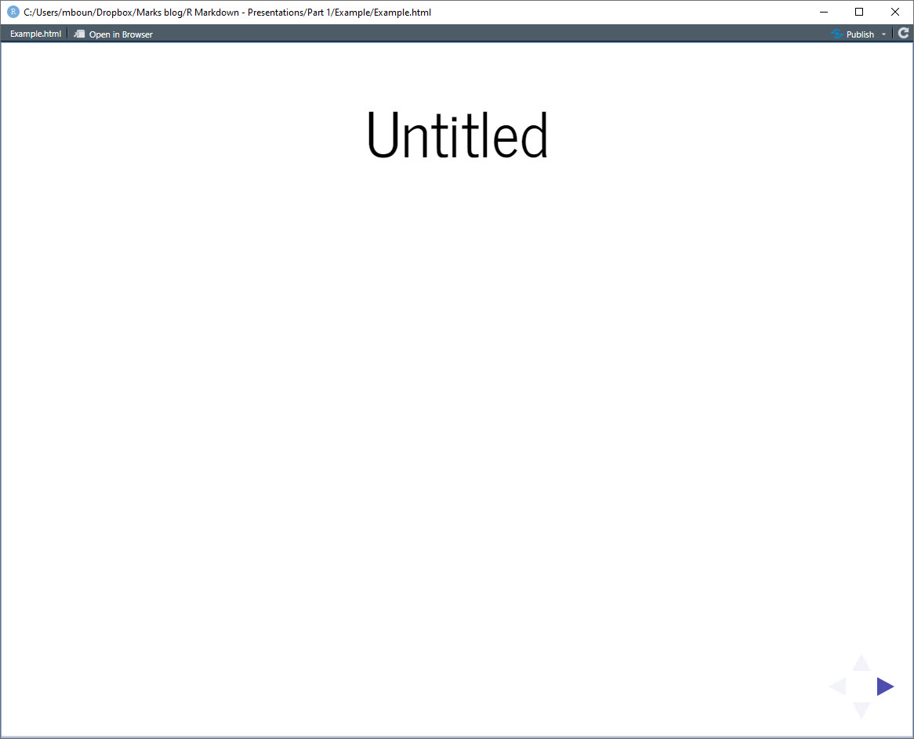

```{r setup, include=FALSE}
knitr::opts_chunk$set(echo = TRUE)
```

## Introduction

Recently, I was invited to give a presentation about my background and current work. I initially developed a slide deck using PowerPoint, but I wasn't happy with the flow and format. I wanted something that had smooth transitions and unique fonts. And, I wanted something non-PowerPoint. 

I remember seeing some of my classmates using Latex to build their slide presentations. So, I looked into seeing whether there was something similar with R Markdown. fortunately, R Markdown has a ton of templates to build slide presentations. For example, [`revealjs`](https://revealjs.com/) is a package that creates wonderful HTML slide presentations. 

[Here is my HTML presentation](https://mbounthavong.github.io/bio_presentation/#/) that I constructed using `revealjs`. You can also view my presentation below:

```{r, echo = FALSE, warning = FALSE, message = FALSE}
knitr::include_url("https://mbounthavong.github.io/bio_presentation/#/")
```

## Getting started

To start building an HTML presentation, you will need to install `revealjs`. 

```{r, echo = TRUE, warning = FALSE, message = FALSE}
# install.packages("revealjs")
```

Once the `revealjs` package is installed, you can open an R Markdown file and select 

```{r, echo= FALSE, warning = FALSE, message = FALSE, out.width = "100%", fig.cap = "Select the R Markdown option."}

```

After selecting the `revealjs` format, you will get a template to get your started. 


```{r, echo= FALSE, warning = FALSE, message = FALSE, out.width = "100%", fig.cap = "Select the R Markdown option."}

```

Then, render the HTML presentation by selecting the `Knit to revealjs_presentation` option.


```{r, echo= FALSE, warning = FALSE, message = FALSE, out.width = "100%", fig.cap = "Select the R Markdown option."}

```

This will generate a simple HTML presentation. 

```{r, echo= FALSE, warning = FALSE, message = FALSE, out.width = "100%", fig.cap = "Select the R Markdown option."}

```

From here, you can make some adjustments to each slide with your own information. Each `##` denotes the slide breaks. The `-` denotes the bullets. 

Notice that you can embed R code into the slide. This will be useful when you want to show output on your slide presentation. 

## Conclusion

This is the first part on how to construct an HTML presentation using R Markdown and the `revealjs` package. In future tutorials, we'll learn how to use other features to customize the presentation. 

## Acknowledgement

I learned how to start building HTML presentations using the following resources:

* [`revealjs` website](https://revealjs.com/)
* [Tim Mastny's website](https://timmastny.com/blog/embed-slides-knitr-blogdown/) to help embed a presentation into an R Markdown file. 

## Work in progress

This is a work in progress, and I'll likely make updates as I learn more. I created this tutorial to help my future self remember how to construct an HTML presentation. 
